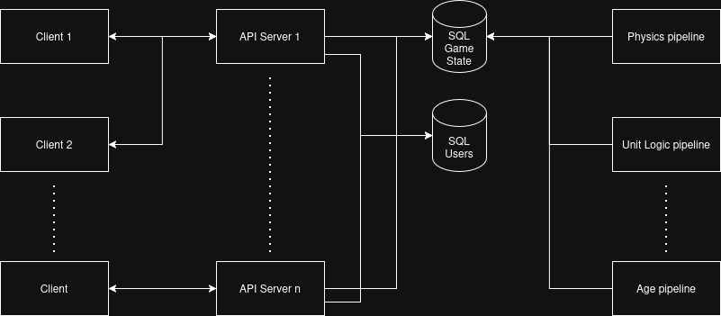

# Network Architecture

The architecture of CWars prioritizes **clarity, scalability, and security** over raw performance. This is a deliberate design choice based on the game's unique characteristics.

## Design Philosophy

### Why Not Speed-First?
- **Script-driven gameplay**: As a programmable RTS where players write scripts to issue API commands, the game doesn't require millisecond-level response times
- **Strategic gameplay**: Decision-making happens in player code, not real-time user input
- **Persistent world**: Long-term stability matters more than peak throughput

### Core Priorities

**1. Clarity**
- Clear separation of concerns between game logic, API layer, and state management
- Straightforward request/response patterns that script developers can reason about
- Well-documented API contracts that make integration predictable

**2. Scalability**
- Horizontal scaling through multiple backend instances behind load balancers
- Stateless API servers that can be added/removed as player load changes
- Game state separated from API handlers to enable independent scaling of computation vs. I/O

**3. Security**
- Authentication/authorization baked into every API endpoint
- Rate limiting to prevent script abuse and ensure fair play
- Input validation to protect against malicious player scripts
- Isolation between player actions to prevent interference

## Architecture Overview

## Network Components

### Clients

**Player Scripts**
- Write code in any language to interact with the game
- Connect via REST API for commands and queries
- Connect via WebSocket for real-time event notifications

**Communication Patterns:**
- **REST API**: Send commands (move units, build structures, train workers)
- **REST API**: Query game state (unit positions, resource counts, world map)
- **WebSocket**: Receive real-time events (unit moved, building completed, combat resolved)

**Recommended Client Behavior:**
- Poll REST endpoints every 2-5 seconds for state updates (if not using WebSocket)
- Use WebSocket connection for instant notifications of important events
- Use batch endpoints to reduce HTTP overhead for multiple commands

### Rate Limiter

**Purpose:** Prevents abuse and ensures fair play across all players

**Rate Limits:**
- Authentication endpoints: 10 requests per minute
- Query endpoints (GET): 100 requests per minute
- Command endpoints (POST): 30 requests per minute
- Batch endpoint: 10 requests per minute

**Implementation:**
- Token bucket algorithm per player
- Returns `429 Too Many Requests` when exceeded
- Includes rate limit headers in all responses:
  - `X-RateLimit-Limit`
  - `X-RateLimit-Remaining`
  - `X-RateLimit-Reset`

### Load Balancer

**Purpose:** Distributes incoming traffic across multiple API server instances

**Technology:** Nginx

**Configuration:**
- **Load Balancing Method:** Round-robin (can be configured to least_conn or ip_hash if needed)
- **Health Checks:** Active health checks every 10 seconds via `/health` endpoint
- **Failover:** Automatic removal of unhealthy instances from rotation
- **SSL/TLS Termination:** Handles HTTPS encryption/decryption at the edge
- **WebSocket Support:** Proxy pass with upgrade headers for WebSocket connections
- **Timeout Settings:** 
  - Client body timeout: 60s
  - Proxy read timeout: 300s (for long-polling scenarios)
  - Keepalive connections: enabled

### API Servers

**Flask REST Servers**
- Multiple stateless Flask instances handle incoming API requests from player scripts
- Horizontally scalable - new instances can be added behind the load balancer as player load increases
- Each API server is independent and can handle any request type

**Responsibilities:**

1. **Authentication & Authorization**
   - Validate JWT tokens against User SQL database
   - Verify player ownership of units/buildings
   - Enforce permissions (players can only control their own entities)

2. **Input Validation**
   - Validate request parameters (position coordinates, unit IDs, resource amounts)
   - Check for malformed data or injection attempts
   - Enforce business rules (e.g., can't build on occupied tiles)

3. **Rate Limiting Enforcement**
   - Check rate limits before processing requests
   - Update rate limit counters
   - Return appropriate error responses

4. **State Queries**
   - Read current game state from Game State SQL database
   - Return unit positions, resource counts, building statuses
   - Provide map data and world information

5. **Command Publishing**
   - Validate commands at submission time
   - Publish commands to Redis Streams (not direct DB writes)
   - Return `202 Accepted` with command_id immediately

6. **Event Subscription & WebSocket Management**
   - Subscribe to player-specific event streams in Redis
   - Maintain WebSocket connections with clients
   - Push real-time events to connected players
   - Handle WebSocket connection lifecycle

**Technology Stack:**
- Flask (web framework)
- Flask-SocketIO (WebSocket support)
- SQLAlchemy (database ORM)
- Redis-py (Redis client)
- JWT (authentication tokens)

### User SQL Database

**Purpose:** Manages player accounts and authentication

**Characteristics:**
- Separate from game state for security isolation
- Smaller dataset, less write-heavy
- Can use different scaling strategy than game state
- Encrypted passwords (bcrypt or argon2)
- Session token expiration (24 hours)

**Access Patterns:**
- Read on every authenticated request (token validation)
- Write on login/logout/registration
- Relatively low write volume compared to game state

### Game State SQL Database

**Purpose:** Stores the persistent game world state

**Characteristics:**
- Stores the current "snapshot" of the persistent world
- High read volume (API servers query constantly)
- High write volume (pipelines update continuously)
- API servers read-only access for queries
- Only pipelines write to this database (ensures consistency)

**Scaling Strategies:**
- Read replicas for API servers (reduce load on primary)
- Partition by world region for very large worlds
- Index on position coordinates for spatial queries
- Index on owner_id for player-specific queries

### Redis Streams

**Purpose:** Event bus between API servers and processing pipelines

**Stream Organization:**

**Command Streams (API → Pipelines):**
- `game:commands:movement` - Unit movement commands
- `game:commands:construction` - Building construction/repair
- `game:commands:training` - Unit training requests
- `game:commands:production` - Resource production orders
- `game:commands:combat` - Attack/defend commands

**Event Streams (Pipelines → API):**
- `game:events:movement` - Unit position updates
- `game:events:construction` - Building status changes
- `game:events:combat` - Battle results
- `game:events:survival` - Unit deaths, starvation, aging
- `game:events:production` - Resource generation/consumption

**Player-Specific Event Streams:**
- `player:{player_id}:events` - All events relevant to specific player

**Consumer Groups:**
- Each pipeline type has a consumer group (e.g., `movement-pipeline-workers`)
- Multiple pipeline instances in same group for load balancing
- Ensures each command processed exactly once
- Failed messages can be retried or moved to dead letter queue

**Persistence:**
- Command streams: Retain for 24 hours (audit trail)
- Event streams: Retain for 1 hour (recent history)
- Player event streams: Retain for 5 minutes (notification window)

**Benefits:**
- Decouples command submission from execution
- Guaranteed delivery and ordering within streams
- Horizontal scaling of both producers and consumers
- Built-in audit trail for debugging
- Low latency (sub-millisecond within datacenter)

### Processing Pipelines

**Architecture:** Independent microservices that process game mechanics

**Pipeline Types:**

**1. Movement Pipeline**
- Consumes: `game:commands:movement`
- Processes: Unit pathfinding, collision detection, position updates
- Writes: Updated unit positions to Game State DB
- Publishes: `game:events:movement` with new positions
- Schedule: Continuous processing, Every 1 second

**2. Production Pipeline**
- Consumes: `game:commands:production`
- Processes: Resource gathering, building production cycles, inventory updates
- Writes: Resource quantities to Game State DB
- Publishes: `game:events:production` for resource changes
- Schedule: Every 5 seconds

**3. Combat Pipeline**
- Consumes: `game:commands:combat`
- Processes: Battle resolution, damage calculation, unit deaths
- Writes: Updated health/status to Game State DB
- Publishes: `game:events:combat` with battle results
- Schedule: Continuous processing, Every 1 second

**4. Survival Pipeline**
- Consumes: (Timer-based, no commands)
- Processes: Food consumption, hunger damage, aging
- Writes: Updated unit stats (food, age, health) to Game State DB
- Publishes: `game:events:survival` for deaths and status changes
- Schedule: Every 10 seconds

**5. Training Pipeline**
- Consumes: `game:commands:training`
- Processes: Unit training queue, completion timing, resource consumption
- Writes: New unit records to Game State DB
- Publishes: `game:events:training` for completion
- Schedule: Every 1 second

**Common Pipeline Characteristics:**
- Stateless - all state in database or Redis
- Can scale horizontally within consumer groups
- Independent failure domains (one crash doesn't affect others)
- Comprehensive logging for debugging
- Metrics exported (processing rate, latency, errors)

**Pipeline Coordination:**
- Pipelines are loosely coupled
- Game state DB is source of truth for conflicts
- Optimistic locking for concurrent updates
- Event ordering handled by Redis Streams
- No direct pipeline-to-pipeline communication
